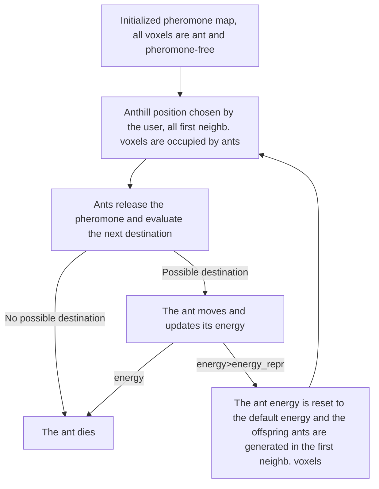

[](https://app.circleci.com/pipelines/github/LorenzoPierfederici98/CAM_algorithm)  [](https://cam-algorithm.readthedocs.io/en/latest/?badge=latest)

## Overview
Repository of the project for the CMEPDA course implementing a Channeler Ant Model (CAM) algorithm in order to segment aerial trees.
The CAM algorithm exploits virtual ant colonies whose behaviour mimics the cooperation strategies put in place by real ants, which is here used in image processing.

The ant colony lives in the digital habitat of the image voxels, in which ants move and deposit pheromone in order to build a pheromone map.
The life cycle of the ants is discretized in iterations: starting from the anthill voxel (chosen by the user) and all its first-order neighbours, the ants deposit pheromone values, corresponding to the respective image voxels intensities, and evaluate the next voxel destination among all the first-order neighbouring voxels not occupied by an ant.
The evaluation of the destination voxel is made by computing a probability for all the free neighbouring voxels, which depends on their pheromone values; the next voxel is chosen with a roulette wheel algorithm, in order to find a balance between random paths and "directional" paths given by the pheromone trails.

The ants lifespan is reuglated by the energy parameter: all the ants are assigned with a default value which varies with every iteration, depending on the pheromone value released by the ant and the pheromone mean per iteration released by the ant colony since the first iteration. Whenever an ant has energy greater than a reproduction value it generates $N_{offspring}\in[0, 26]$ ants, related to the local properties of the enviornment, which are placed in the free first-order neighbouring voxels; if the energy is lower than a certain value or if the ant has no possible voxel destination it dies.
Following those rules the ants build the pheromone map, which is deployed to segment bronchial and vascular trees in lung CT images. The algorithm parameters are defined in the documentation.

## Workflow

## Usage
The user has to provide the voxel position of the anthill from which the segmentation starts and the path of the image dicom directory.

```python3.10 main.py -h
usage: main.py [-h] [--file_path str]
               voxel_coordinate voxel_coordinate
               voxel_coordinate n_iteration

Module implementing the CAM algorithm.

positional arguments:
  voxel_coordinate  The anthill voxel position.
  n_iteration       Number of iterations before stopping.  

options:
  -h, --help        show this help message and exit        
  --file_path str   The absolute path of the image
                    directory.
```
The run results, such as the image matrix dimensions, the pheromone map, the evaluation metrics and the elapsed time, are placed in the results directory.

## References
[Cerello, Piergiorgio, et al. "3-D object segmentation using ant colonies." Pattern Recognition 43.4 (2010): 1476-1490.](https://www.sciencedirect.com/science/article/abs/pii/S003132030900380X?via%3Dihub)

