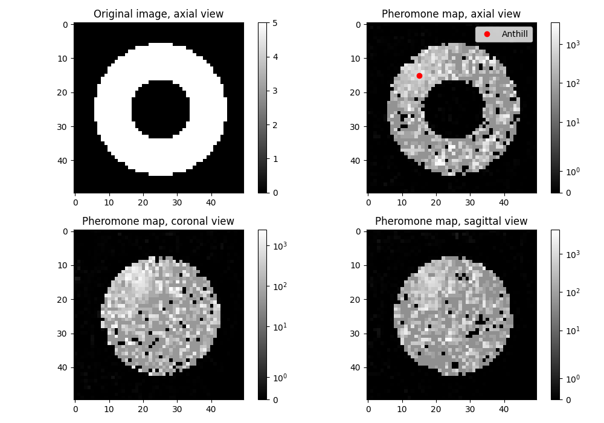
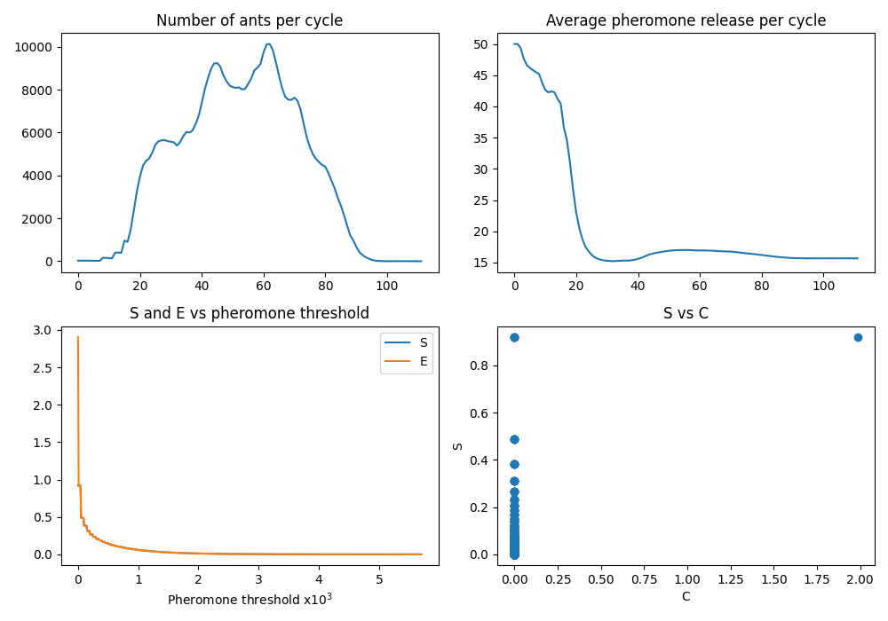

[](https://app.circleci.com/pipelines/github/LorenzoPierfederici98/CAM_algorithm)  [](https://cam-algorithm.readthedocs.io/en/latest/?badge=latest)

## Overview
Repository of the project for the CMEPDA course implementing a Channeler Ant Model (CAM) algorithm in order to segment aerial trees.
The CAM algorithm exploits virtual ant colonies whose behaviour mimics the cooperation strategies put in place by real ants, which is here used in image processing.

The ant colony lives in the digital habitat of the image voxels, in which ants move and deposit pheromone in order to build a pheromone map.
The life cycle of the ants is discretized in iterations: starting from the anthill voxel (chosen by the user) and all its first-order neighbours, the ants deposit pheromone values, corresponding to the respective image voxels intensities, and evaluate the next voxel destination among all the first-order neighbouring voxels not occupied by an ant.
The evaluation of the destination voxel is made by computing a probability for all the free neighbouring voxels, which depends on their pheromone values; the next voxel is chosen with a roulette wheel algorithm, in order to find a balance between random paths and "directional" paths given by the pheromone trails.

The ants lifespan is regulated by the energy parameter: all the ants are assigned with a default value which varies with every iteration, depending on the pheromone value released by the ant and the pheromone mean per iteration released by the ant colony since the first iteration. Whenever an ant has energy greater than a reproduction value it generates $N_{offspring}\in[0, 26]$ ants, related to the local properties of the enviornment, which are placed in the free first-order neighbouring voxels; if the energy is lower than a certain value or if the ant has no possible voxel destination it dies.
Following those rules the ants build the pheromone map, which is deployed to segment bronchial and vascular trees in lung CT images. The algorithm parameters are defined in the documentation (click on the *docs* badge).

## Workflow

## Usage
The user has to provide the voxel position of the anthill from which the segmentation starts and the number of iterations.
There are four possible choices, given by ```{file_path,cube,sphere/ellipsoid,donut}```

```python3.10 main.py -h
usage: main.py [-h] [-a int int int] [-n int]
               {file_path,cube,sphere/ellipsoid,donut} ...


Module implementing the CAM algorithm.

positional arguments:
  {file_path,cube,sphere/ellipsoid,donut}
                        sub-command help
    file_path           The DICOM folder path
    cube                Returns a cube as the image matrix.
    sphere/ellipsoid    Returns a sphere/ellipsoid as the image
                        matrix.
    donut               Returns a donut as the image matrix i.e a
                        sphere with a concentric hole with half
                        external radius as the internal radius.

options:
  -h, --help            show this help message and exit
  -a int int int, --anthill_coordinates int int int
                        The anthill voxel position.
  -n int, --n_iteration int
                        Number of iterations before stopping.
```

```python3.10 main.py file_path -h
usage: main.py file_path [-h] [-f str]

options:
  -h, --help            show this help message and exit
  -f str, --file_path str
                        The DICOM folder path.
```

```python3.10 main.py cube -h     
usage: main.py cube [-h] [-m int int int] [-c int int int]
                    [-l int]

options:
  -h, --help            show this help message and exit
  -m int int int, --matrix_dimensions int int int
                        Image matrix dimensions.
  -c int int int, --center_coordinates int int int
                        The cube center.
  -l int, --cube_length int
                        The cube length.
```

```python3.10 main.py sphere/ellipsoid -h
usage: main.py sphere/ellipsoid [-h] [-m int int int]
                                [-c int int int] [-s int int int]  
                                [-r int]

options:
  -h, --help            show this help message and exit
  -m int int int, --matrix_dimensions int int int
                        Image matrix dimensions.
  -c int int int, --center_coordinates int int int
                        The center of the figure.
  -s int int int, --semi_axes int int int
                        The semi-axes lengths.
  -r int, --radius int  The radius of the figure.
```

```python3.10 main.py donut -h                                                             
usage: main.py donut [-h] [-m int int int] [-c int int int]
                     [-r int]

options:
  -h, --help            show this help message and exit
  -m int int int, --matrix_dimensions int int int
                        Image matrix dimensions.
  -c int int int, --center_coordinates int int int
                        The center of the donut.
  -r int, --radius int  The external radius of the donut.
```

The run results, such as the image matrix dimensions, the pheromone map, the evaluation metrics and the elapsed time, are placed in the results directory.

## Example

```python3.10 main.py -a 45 35 20 -n 300 donut -m 100 100 50 -c 50 50 25 -r 30```

Produces

  

## References
[Cerello, Piergiorgio, et al. "3-D object segmentation using ant colonies." Pattern Recognition 43.4 (2010): 1476-1490.](https://www.sciencedirect.com/science/article/abs/pii/S003132030900380X?via%3Dihub)

